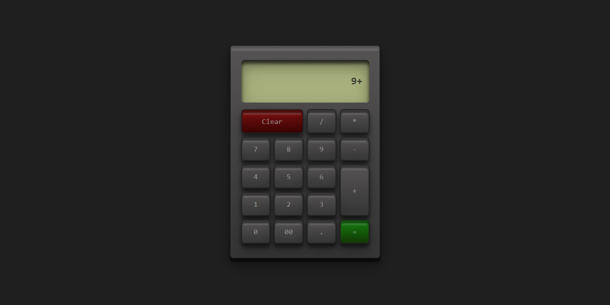

# React Calculator

A simple calculator application built with React. This app supports basic arithmetic operations and provides a clean and functional UI.

## Features

- Basic arithmetic operations: addition, subtraction, multiplication, and division.
- Clear button to reset the calculation.
- Error handling for invalid expressions.

## Components

- **`App.js`**: Main component that manages the state and logic of the calculator. It provides the `keyData` context and handles button clicks.
- **`Container.js`**: A layout component that wraps the calculator UI. Styled with `Container.module.css`.
- **`Display.js`**: Displays the current calculation or result. Styled with `Display.module.css`.
- **`Keys.js`**: Renders calculator buttons and handles button clicks. Uses the `keyContext` to get the button labels and applies styles from `Keys.module.css`.

## Styles

- **`App.module.css`**: Global styles for the application.
- **`Container.module.css`**: Styles for the container wrapping the calculator.
- **`Display.module.css`**: Styles for the display area where the calculation is shown.
- **`Keys.module.css`**: Styles for the calculator buttons.
